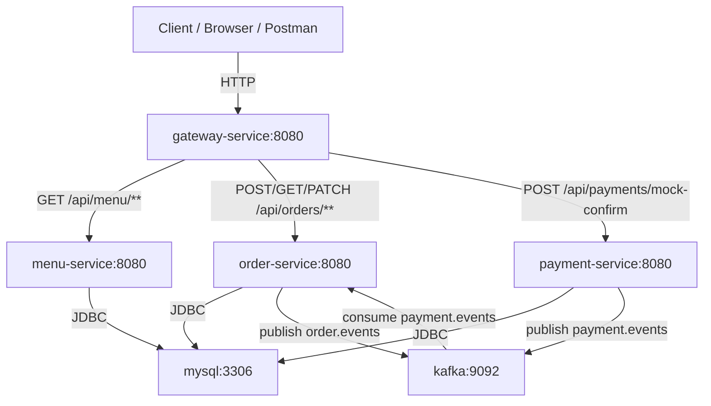
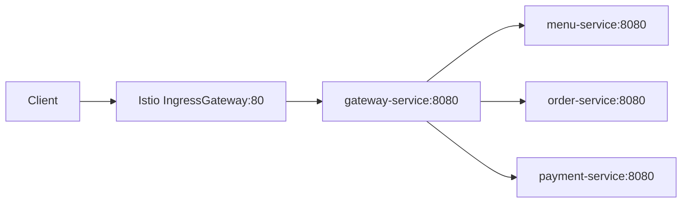

# System Communication Graph

This page shows the simplified 4-service system.

Important note:

- use Kubernetes service DNS names, not fixed pod IPs
- current stable endpoints are `gateway-service:8080`, `menu-service:8080`, `order-service:8080`, `payment-service:8080`, `mysql:3306`, and `kafka:9092`

## Whole System Graph

## Focused Istio Graph

## Port And Reason Table

| From | To | Port | Why |
|---|---|---|---|
| Client | `gateway-service` | `8080` | main local entry |
| Client | `istio-ingressgateway` | `80` | mesh demo entry |
| `gateway-service` | `menu-service` | `8080` | menu APIs |
| `gateway-service` | `order-service` | `8080` | order APIs |
| `gateway-service` | `payment-service` | `8080` | payment confirm API |
| `menu-service` | `mysql` | `3306` | menu data |
| `order-service` | `mysql` | `3306` | order data |
| `payment-service` | `mysql` | `3306` | payment data |
| `order-service` | `kafka` | `9092` | publish order facts |
| `payment-service` | `kafka` | `9092` | publish payment results |
| `order-service` | `kafka` | `9092` | consume payment results |
